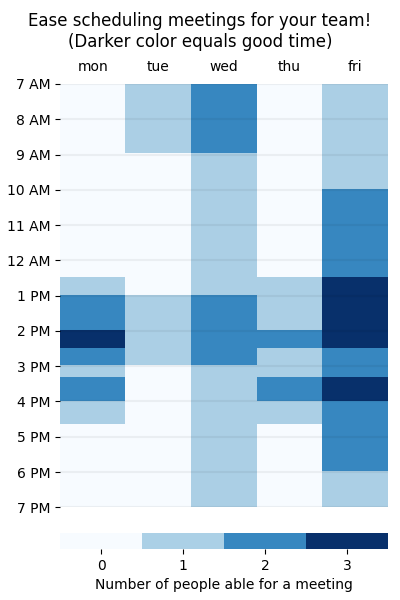

# easymeet


Tool made to help teams find the most optimized time for a meeting.


## instalation

~Gotta write here...~


## Usage

Basically create a Python dictionary with people names as keys and their available intervals per day as values. Hours and minutes are separated by colons (":") or "h"'s. Interval starts and ends are separated by minus signs ("-") or reticences ("..."). For example:

```
people = {
  #name        mon       tue         wed       thu         fri sat
  "Person A": "7h00-9h30 10h00-11h30 7:00-9:30 10:00-11:30  -  -12h"
  # This person has malleable Fridays: "-" here means all day.
  # This person is also able for meetings on Saturday mornings.
}
```

I wanted to be able to write intervals fast, so this program accepts time in many formats. For example, next code is equivalent to the first one

```
people = {
  "person a": "7-9h30 10...11:30 mon tue ..."
  # as you can see, pure "..." also means all day
}
```

Notice that you can also refference previously stated days, when they are equivalent.

Let's say you want to tell easymeet that someone has multiple available intervals. You could do that by putting all of them inside parenthesis:

```
people = {
  #name        mon               tue           wed
  "Person B": "(7-12 13h30-16)   (mon + 19-21) none"
  # the "+" sign is optional.
}
```

Any string other than pre-defined or used defined days of the week will be treated as a null interval. So "none" above would mean the same as 'nope' or 'something' would: an empty interval. More realistically, "none" here will mean "this person is not available in this day".

Look at the exemple files for more practical understanding.


# Other examples


